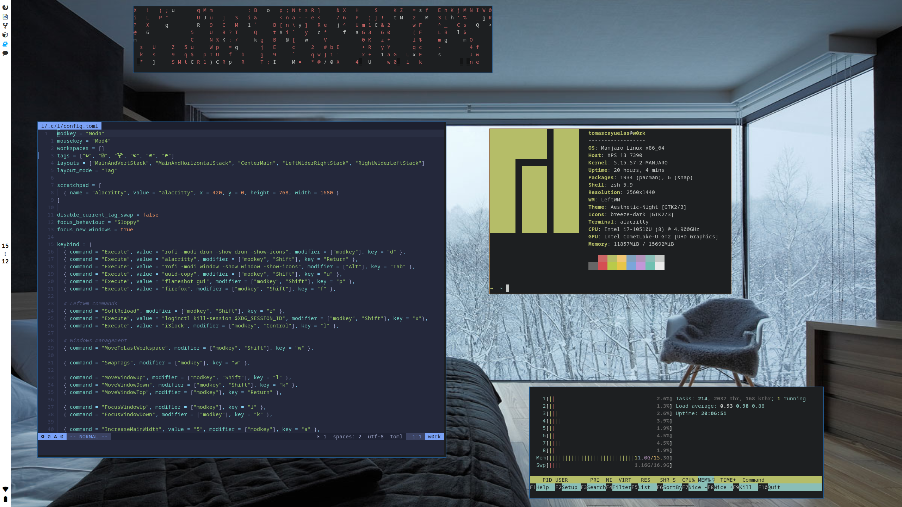

# Welcome !
I'm [@tomascayuelas](https://github.com/tomascayuelas/). Welcome to my [dot]files :dromedary_camel:

 

# Information
- Operating System: [Manjaro Linux](https://manjaro.org/)
- Window Manager: [LeftWM](https://github.com/leftwm/leftwm)
- Notification Daemon: [Wired](https://github.com/Toqozz/wired-notify)

 

## Packages
- [Alacritty](https://github.com/alacritty/alacritty) - A fast, cross-platform, OpenGL terminal emulator
- [Rofi](https://github.com/davatorium/rofi) - A window switcher, Application launcher and dmenu replacement
- [ZSH](https://github.com/zsh-users/zsh) - Shell with lots of features
- [Git](https://git-scm.com/) - Distributed version control system
- [neovim](https://github.com/neovim/neovim) - Hyperextensible Vim-based text editor
- [SdkMan](https://sdkman.io) - The Software Development Kit Manager
- [nvm](https://github.com/nvm-sh/nvm) - A version manager for node.js
- [fzf](https://github.com/junegunn/fzf) - A general-purpose command-line fuzzy finder
- [htop](https://htop.dev/) - A interactive process viewer
- [exa](https://github.com/ogham/exa) - A modern replacement for ls
- [bat](https://github.com/sharkdp/bat) -  A cat(1) clone with syntax highlighting and Git integration
- [jq](https://github.com/stedolan/jq) - A lightweight and flexible command-line JSON processor
- [yq](https://github.com/mikefarah/yq) - A lightweight and portable command-line YAML, JSON and XML processor
- [fzf](https://github.com/junegunn/fzf) - A general-purpose command-line fuzzy finder
- [Wired](https://github.com/Toqozz/wired-notify) - A light and fully customizable notification daemon

 

## ZSH - Plugins
- [oh-my-zsh](https://github.com/ohmyzsh/ohmyzsh) - OH-MY-ZSH!!!
- [docker](https://github.com/ohmyzsh/ohmyzsh/tree/master/plugins/docker) - Adds auto-completion and aliases for docker
- [nvm](https://github.com/ohmyzsh/ohmyzsh/tree/master/plugins/nvm) - Adds autocompletion for nvm
- [z](https://github.com/ohmyzsh/ohmyzsh/tree/master/plugins/z) - Jump around (Tracks your most used directories, based on 'frecency')
- [fzf](https://github.com/ohmyzsh/ohmyzsh/tree/master/plugins/fzf) - A fuzzy auto-completion and key bindings.
- [git](https://github.com/ohmyzsh/ohmyzsh/tree/master/plugins/git) - Provides many aliases and a few useful functions
- [kubectl](https://github.com/ohmyzsh/ohmyzsh/tree/master/plugins/kubectl) - Adds completion for the Kubernetes cluster manager and some aliases

## Thanks
- to [Itsnexn](https://github.com/Itsnexn/dotfiles) dotfiles
